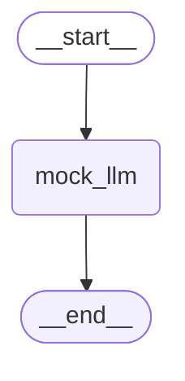

```mermaid
graph TD;
        __start__([<p>__start__</p>]):::first
        mock_llm(mock_llm)
        __end__([<p>__end__</p>]):::last
        __start__ --> mock_llm;
        mock_llm --> __end__;
        classDef default fill:#f2f0ff,line-height:1.2
        classDef first fill-opacity:0
```